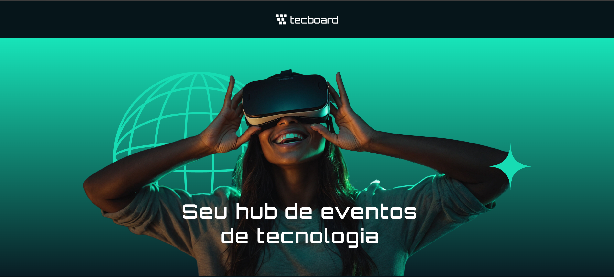
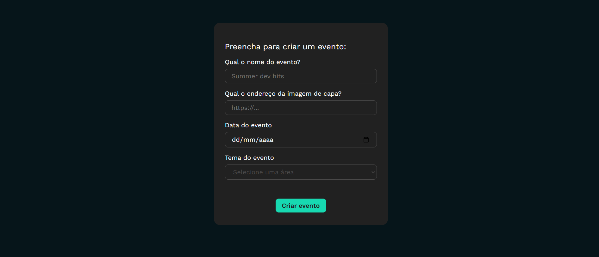
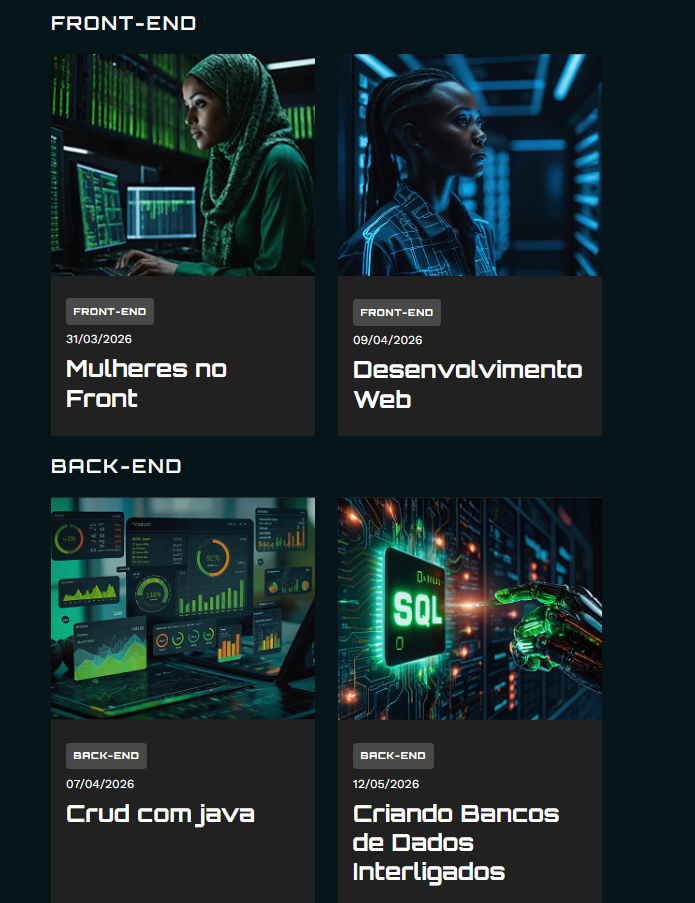

# 🚀 Tecboard Cursos

Plataforma para organização e visualização de cursos de tecnologia, com foco em uma experiência simples, rápida e intuitiva.

---

## 🌐 Acesse o projeto

https://tecboard-cursos-l1ov3i0ox-waldemar-leonardo.vercel.app/

---

## 📌 Sobre o projeto

O **Tecboard Cursos** é uma aplicação desenvolvida com o objetivo de centralizar e organizar conteúdos educacionais por categorias, facilitando o acesso e a navegação entre cursos de tecnologia.

Este projeto foi desenvolvido com base em aprendizados adquiridos na plataforma **Alura**, aplicando conceitos modernos de desenvolvimento front-end.

---

## 🎯 Funcionalidades

- 📚 Listagem de cursos
- 🏷️ Organização por categorias (Front-end, Back-end, DevOps, etc.)
- ⚡ Interface rápida e responsiva
- 🎨 Layout moderno e intuitivo

---

## 📸 Preview do Projeto

### 🏠 Tela Inicial

  

### 📝 Formulario

  

### 📚 Cursos

  

### 📱 Responsividade

  

---

## 🎬 Demonstração

  

---

## 🛠️ Tecnologias utilizadas

- HTML5
- CSS3
- JavaScript
- React
- Vite
- Node
- JSX

---

🎓 Créditos

Projeto desenvolvido com base nos cursos da plataforma Alura, com adaptações e implementações próprias.

---

👨‍💻 Autor

Desenvolvido por Waldemar Leonardo Freitas Carvalho

GitHub: https://github.com/Waldemarleo
LinkedIn: https://www.linkedin.com/in/waldemar-leonardo/
